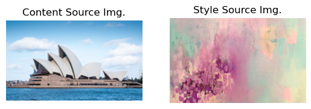
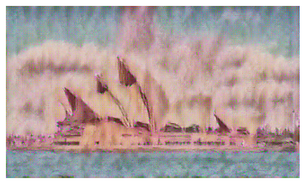

# Neural Style Transfer

## Project Overview

This project contains a neural style transfer implementation that enables the stylistic combination of content from one image with the style of another. The project leverages Convolutional Neural Networks (CNNs) to transfer the style of a given artwork to a content image.

## Model Architecture

The implementation uses a series of convolutional blocks, each consisting of convolutional layers followed by batch normalization, ReLU activation, and max-pooling. The network aims to minimize content and style losses, achieving a visually pleasing blend of the content and artistic style.

## Features

- Utilizes a pre-trained SqueezeNet model to extract features from images.
- Employs Content, Style, and Total Variation losses to guide the style transfer process.
- Supports multiple style transfer configurations, including various artworks and content images.

## Style Transfer Process

The style transfer script performs the following steps:

1. Extracts features from the content and style images using a CNN.
2. Computes the content loss at a specified layer to preserve the content of the original image.
3. Computes the style loss at multiple layers to match the style of the artwork.
4. Applies total variation loss to smooth the resulting image.

## Results
Below are some examples of the results obtained from the neural style transfer model:
### Content and Style Source Images

*Content and Style Source Img.*

*Style Transferred Img.*

